# Timetable SaaS Project (時間割管理アプリ)

**Group Name:** ベッド・モット・ムリ・テッツヤーズ
**App URL:** https://timetable-y91y.onrender.com/
> **Note:** 無料プランのサーバー(Render Free Tier)を使用しているため、
> **最初のアクセス時は起動に約50秒〜1分かかります。エラーではありませんのでご安心ください。**

---

## 🎥 1. Demonstration
実際のアプリの動作デモ動画です。

**Demo Video URL:**
[リンク: ここにYouTubeまたはGoogleDriveの共有リンクを貼ってください]

> **動画の内容:**
> 1. ユーザーログイン
> 2. 新しい時間割の作成
> 3. 授業の登録（曜日・時限の選択）
> 4. エラーハンドリング（重複登録時の警告）の確認

---

## 🗓 2. Project Management (PM)
GitHub Projects (Kanban Board) を活用し、タスクの可視化と進捗管理を行いました。

**Kanban Board Snapshot:**
[]
(https://github.com/users/Takahashi-kimchi/projects/1/views/1?layout_template=boa)

---

## 👤 3. User Analysis (Business Analyst)

### Target Persona (ペルソナ)
* **名前:**
髙橋響
* **職業:**
大学二年生
* **概要:**
大学生活に慣れてきたが、バイトとの両立に苦しんでおり、操作性の高い時間割アプリを使いたいと思っている。今までいくつかの時間割アプリを使ってきたが、拡張性の低さに苦しんでいる。
* **システムへの要件:**
時限、曜日を自由に変えられる、時限や曜日の部分は自由記述にすることで講義以外の予定の管理もできるとよい。ToDoリストは実装してほしい。授業ごとのToDoリストの進捗度もわかるとうれしい。

### Story Board (利用シナリオ)
ユーザーが課題を解決するまでのストーリー：

1. **Scene 1 (課題発生):** [記述: 朝、寝坊して教室がわからない！ポータルも繋がらない！]
2. **Scene 2 (解決策):** [記述: Timetable SaaSを開く。0.5秒で時間割が表示される。]
3. **Scene 3 (価値享受):** [記述: 「あ、3号館か」と即座に理解し、遅刻を回避。]

---

## 🏗 4. System Architecture (Architect)
クラウドネイティブな **Web 3層構造 (Web 3 Layer Architecture)** を採用しました。

### Architecture Diagram

```mermaid
%%{init: {'theme': 'neutral'} }%%
graph LR
    User(("User<br/>(PC / Mobile)"))
    DNS{"DNS<br/>onrender.com"}
    
    subgraph "Application Server (Render)"
        LB["Load Balancer<br/>(Render Proxy)"]
        Gunicorn["WSGI Server<br/>(Gunicorn)"]
        Django["Web App<br/>(Django Framework)"]
        Static["Static Files<br/>(WhiteNoise)"]
    end
    
    subgraph "Database Server (Neon)"
        DB[("RDBMS<br/>PostgreSQL")]
    end

    %% データã®æµã‚Œ
    User -- HTTPS Request --> DNS
    DNS --> LB
    LB --> Gunicorn
    Gunicorn --> Django
    
    Django -- SQL Query --> DB
    DB -- Result Data --> Django
    
    Django -- Read CSS/JS --> Static
    Django -- HTML Response --> User

    %% スタイル定義
    style User fill:#f9f,stroke:#333
    style Django fill:#bbf,stroke:#333
    style DB fill:#bfb,stroke:#333

```

### Non-Functional Requirements (非機能要件の定義)
* **RPO (Recovery Point Objective):** 24時間
    * Neon DatabaseのPITR (Point-in-Time Recovery) 機能に準拠。
* **RTO (Recovery Time Objective):** 1時間以内
    * GitHub ActionsによるCI/CDパイプラインと、IaC (Infrastructure as Code) 的な構成により迅速な復旧が可能。
* **Performance Strategy:**
    * **WhiteNoise** を導入し、Webサーバー単体で静的ファイル（CSS/JS）を高速配信。
    * **Gunicorn** を用いた並列処理によるレスポンス最適化。

---

## 🗃 5. Database Design (DBA)
データの整合性を最優先し、リレーショナルデータベース (PostgreSQL) を採用しました。

### ER Diagram

```mermaid
%%{init: {'theme': 'neutral'} }%%
erDiagram
    %% 定義
    User ||--o{ Timetable : "Creates"
    Timetable ||--|{ Day : "Has"
    Timetable ||--|{ Period : "Has"
    Day ||--o{ Schedule : "Contains"
    Period ||--o{ Schedule : "Contains"

    %% テーブル詳細
    User {
        int id PK
        string username
        string password_hash
    }

    Timetable {
        int id PK
        string name "Semester Name"
        boolean is_default
        int user_id FK
    }

    Day {
        int id PK
        string name "Mon/Tue"
        int order
        int timetable_id FK
    }

    Period {
        int id PK
        string name "1st/2nd"
        int order
        int timetable_id FK
    }

    Schedule {
        int id PK
        string subject
        string memo
        int day_id FK
        int period_id FK
    }
```

### Key Database Features (評価ポイント)
* **Normalization (正規化):**
    * データの重複を排除するため、`User` - `Timetable` - `Day`/`Period` - `Schedule` の4テーブル構成とし、第3正規形 (3NF) まで正規化を行いました。
* **Transactional Integrity (トランザクション管理):**
    * 授業登録処理などは `atomic` なトランザクションとして実行。
    * 保存中にエラーが発生した場合は自動的に **Rollback** され、データの不整合（中途半端な書き込み）を防ぎます。
* **Foreign Key Constraints (参照整合性):**
    * `ON DELETE CASCADE` 制約を設定。ユーザーや時間割を削除した際、関連する授業データも自動的にクリーンアップされる設計です。

---

## 💻 6. Technical Stack & Process
このアプリケーションは以下の技術スタックで構築されています。

| Layer | Technology | Description |
| :--- | :--- | :--- |
| **Frontend** | HTML5, Bootstrap 5 | レスポンシブデザイン対応 (Mobile First) |
| **Backend** | Python 3.12, Django 5.0 | MVTアーキテクチャ, バリデーションロジック |
| **Database** | PostgreSQL (Neon) | Serverless SQL Database |
| **Infrastructure** | Render | PaaS (Platform as a Service) |
| **Version Control** | Git / GitHub | ソースコード管理 |

### Application Process Flow
1. **Request:** ユーザーがHTTPSリクエストを送信。
2. **Routing:** Djangoの `urls.py` がリクエストを解析し、適切なViewに振り分け。
3. **Logic:** `views.py` がDBからデータを取得し、重複チェック等のビジネスロジックを実行。
4. **Response:** データを埋め込んだHTMLテンプレートをレンダリングして返却。
