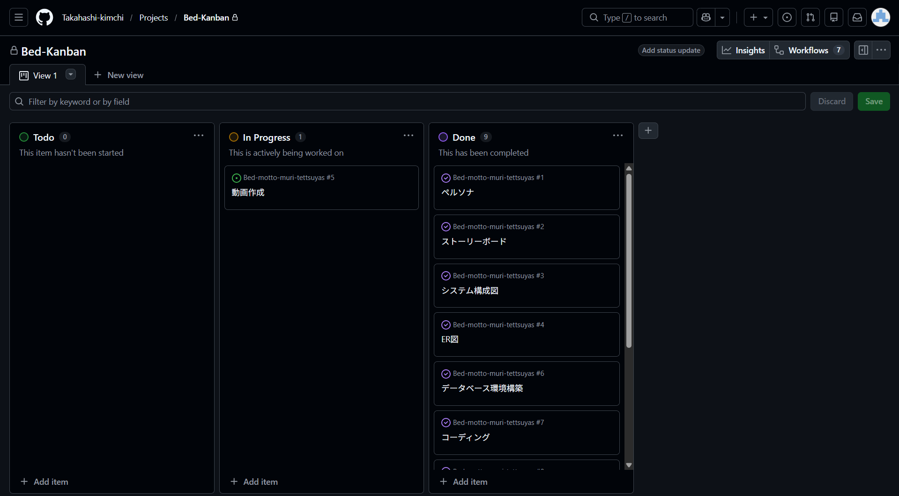
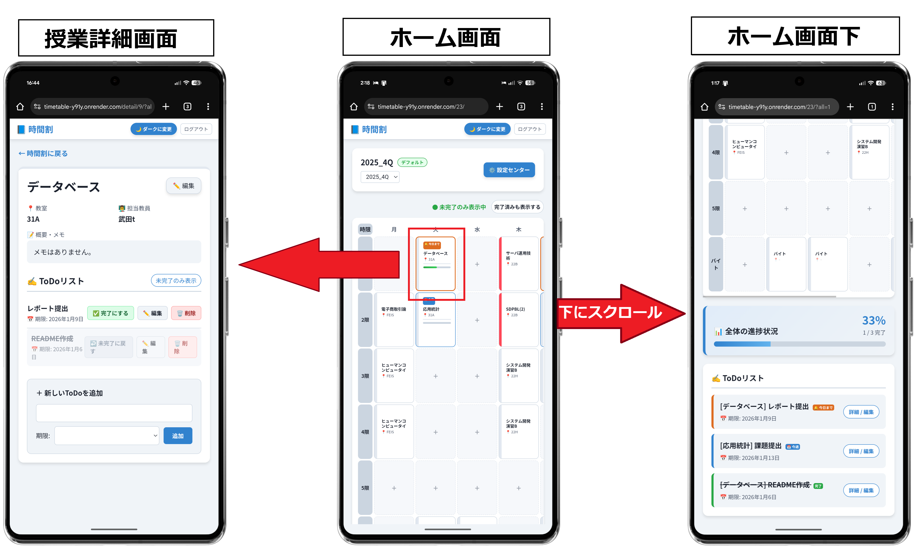
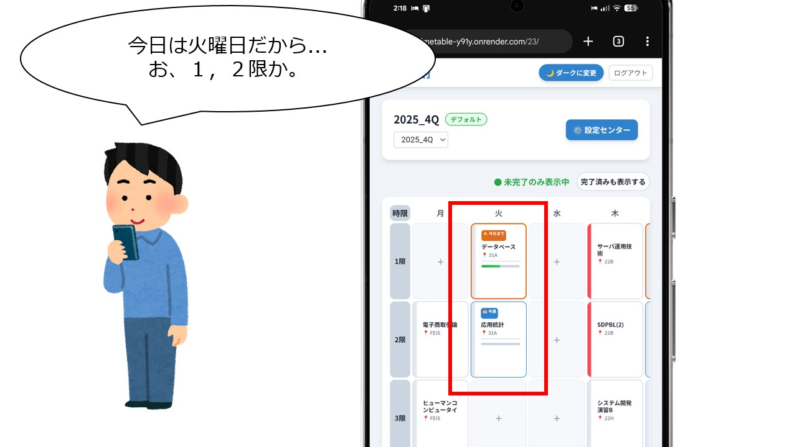
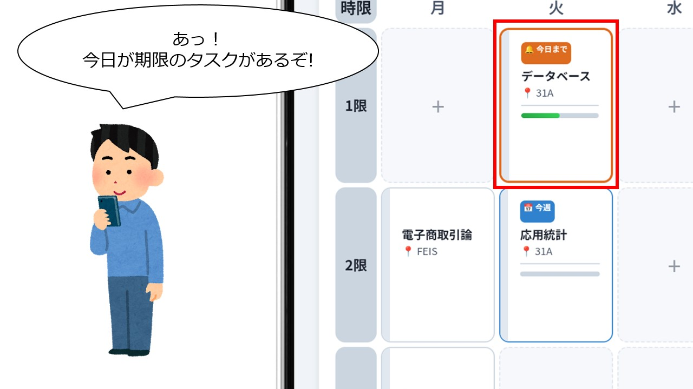
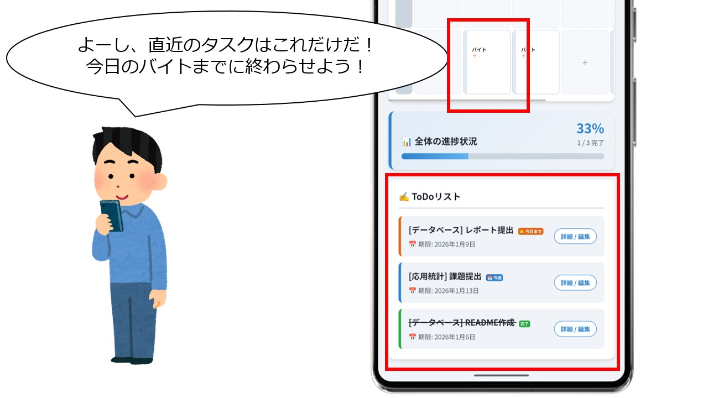
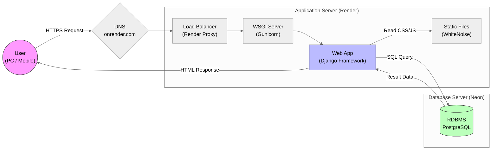
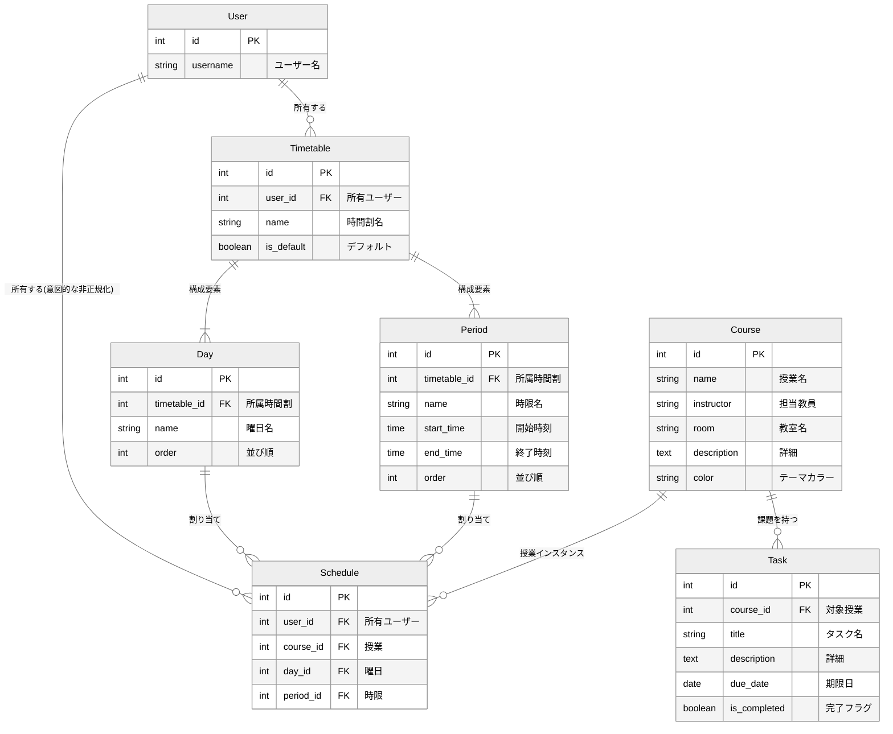

# 時間割管理アプリ

**Group Name:** ベッド・モット・ムリ・テッツヤーズ

**Group Member:** 髙橋響(2442051)、西村優輝(2442064)、本間央樹(2442076)、横井仁(2442091)

> **App URL:** https://timetable-y91y.onrender.com/
> 
> **Note:** 無料プランのサーバー(Render Free Tier)を使用しているため、
> **起動に約1分かかることがありますが、エラーではありませんのでご安心ください。**

---

## 🎥 1. Demonstration
実際のアプリの動作デモ動画です。

https://github.com/user-attachments/assets/7beec6b5-3930-49d1-83e7-a78b9cbb2416

---

## 🗓 2. Project Management (PM)
GitHub Projects (Kanban Board) を活用し、タスクの可視化と進捗管理を行いました。

**Kanban Board Snapshot:**

([https://github.com/users/Takahashi-kimchi/projects/1/views/1?layout_template=boa](https://github.com/users/Takahashi-kimchi/projects/1))

---

## 👤 3. User Analysis (Business Analyst)

### Target Persona (ペルソナ)
* **名前:**
髙橋響
* **職業:**
大学二年生
* **概要:**
大学生活に慣れてきたが、バイトとの両立に苦しんでおり、操作性の高い時間割アプリを使いたいと思っている。今までいくつかの時間割アプリを使ってきたが、拡張性の低さに苦しんでいる。
* **システムへの要件:**
時限、曜日を自由に変えられる、時限や曜日の部分は自由記述にすることで講義以外の予定の管理もできるとよい。ToDoリストは実装してほしい。授業ごとのToDoリストの進捗度もわかるとうれしい。

## 📱 UI/UX Highlights
本アプリケーションは「毎日使いたくなる」視認性と操作性を追求しました。

### Story Board (利用シナリオ)
ユーザーが課題を解決するまでのストーリー：

---

## 🏗 4. System Architecture (Architect)
クラウドネイティブな **Web 3層構造 (Web 3 Layer Architecture)** を採用しました。

### Architecture Diagram

```mermaid
%%{init: {'theme': 'neutral'} }%%
graph LR
    User(("User<br/>(PC / Mobile)"))
    DNS{"DNS<br/>onrender.com"}
    
    subgraph "Application Server (Render)"
        LB["Load Balancer<br/>(Render Proxy)"]
        Gunicorn["WSGI Server<br/>(Gunicorn)"]
        Django["Web App<br/>(Django Framework)"]
        Static["Static Files<br/>(WhiteNoise)"]
    end
    
    subgraph "Database Server (Neon)"
        DB[("RDBMS<br/>PostgreSQL")]
    end

    %% データの流れ
    User -- HTTPS Request --> DNS
    DNS --> LB
    LB --> Gunicorn
    Gunicorn --> Django
    
    Django -- SQL Query --> DB
    DB -- Result Data --> Django
    
    Django -- Read CSS/JS --> Static
    Django -- HTML Response --> User

    %% スタイル定義
    style User fill:#f9f,stroke:#333
    style Django fill:#bbf,stroke:#333
    style DB fill:#bfb,stroke:#333

```

### Non-Functional Requirements (非機能要件の定義)
* **RPO (Recovery Point Objective):** 24時間
    * Neon DatabaseのPITR (Point-in-Time Recovery) 機能に準拠。
* **RTO (Recovery Time Objective):** 1時間以内
    * GitHub ActionsによるCI/CDパイプラインと、IaC (Infrastructure as Code) 的な構成により迅速な復旧が可能。
* **Performance Strategy:**
    * **WhiteNoise** を導入し、Webサーバー単体で静的ファイル（CSS/JS）を高速配信。
    * **Gunicorn** を用いた並列処理によるレスポンス最適化。

---

## 🗃 5. Database Design (DBA)
データの整合性を最優先し、リレーショナルデータベース (PostgreSQL) を採用しました。

### ER Diagram

```mermaid
%%{init: {'theme': 'neutral'} }%%
erDiagram
    User ||--o{ Timetable : "所有する"
    User ||--o{ Schedule : "所有する(意図的な非正規化)"
    Timetable ||--|{ Day : "構成要素"
    Timetable ||--|{ Period : "構成要素"
    
    Day ||--o{ Schedule : "割り当て"
    Period ||--o{ Schedule : "割り当て"
    
    Course ||--o{ Schedule : "授業インスタンス"
    Course ||--o{ Task : "課題を持つ"

    User {
        int id PK
        string username "ユーザー名"
    }

    Timetable {
        int id PK
        int user_id FK "所有ユーザー"
        string name "時間割名"
        boolean is_default "デフォルト"
    }

    Day {
        int id PK
        int timetable_id FK "所属時間割"
        string name "曜日名"
        int order "並び順"
    }

    Period {
        int id PK
        int timetable_id FK "所属時間割"
        string name "時限名"
        time start_time "開始時刻"
        time end_time "終了時刻"
        int order "並び順"
    }

    Course {
        int id PK
        string name "授業名"
        string instructor "担当教員"
        string room "教室名"
        text description "詳細"
        string color "テーマカラー"
    }

    Schedule {
        int id PK
        int user_id FK "所有ユーザー"
        int course_id FK "授業"
        int day_id FK "曜日"
        int period_id FK "時限"
    }

    Task {
        int id PK
        int course_id FK "対象授業"
        string title "タスク名"
        text description "詳細"
        date due_date "期限日"
        boolean is_completed "完了フラグ"
    }
```

### Key Database Features (評価ポイント)

- **高度な正規化 (Normalization)** 
  `Course`（授業情報）と `Schedule`（配置情報）を分離。週複数回の授業でも課題（Task）やメモを自動共有し、データの重複を排除しています。

- **複合ユニーク制約 (Unique Constraints)** 
  `unique_together = ('user', 'day', 'period')` を設定。DBレベルの物理制約とUI層の論理チェックを組み合わせた二重ガードで、登録の衝突を未然に防ぎます。

- **戦略的な参照整合性 (Foreign Key Strategy)** 
  `CASCADE`（一括削除）と `PROTECT`（誤削除防止）を機能ごとに使い分け。関連データのクリーンアップロジックも実装し、データの整合性を維持しています。

- **トランザクションの原子性 (Atomic Transactions)** 
  `@transaction.atomic` を採用。授業の新規登録や再利用プロセスを不可分な操作として扱い、エラー時の完全ロールバックによってデータの不整合を防ぎます。

- **戦略的非正規化 (Strategic Denormalization)** 
  パフォーマンスを考慮し、頻繁なアクセスが発生する `Schedule` モデルにあえて所有者情報を持たせることで、クエリ速度を劇的に向上させています。

---

## 💻 6. Technical Stack & Process
このアプリケーションは以下の技術スタックで構築されています。

| Layer | Technology | Description |
| :--- | :--- | :--- |
| **Frontend** | HTML5, Bootstrap 5 | レスポンシブデザイン対応 (Mobile First) |
| **Backend** | Python 3.12, Django 5.0 | MVTアーキテクチャ, バリデーションロジック |
| **Database** | PostgreSQL (Neon) | Serverless SQL Database |
| **Infrastructure** | Render | PaaS (Platform as a Service) |
| **Version Control** | Git / GitHub | ソースコード管理 |

### Application Process Flow
1. **Request:** ユーザーがHTTPSリクエストを送信。
2. **Routing:** Djangoの `urls.py` がリクエストを解析し、適切なViewに振り分け。
3. **Logic:** `views.py` がDBからデータを取得し、重複チェック等のビジネスロジックを実行。
4. **Response:** データを埋め込んだHTMLテンプレートをレンダリングして返却。
